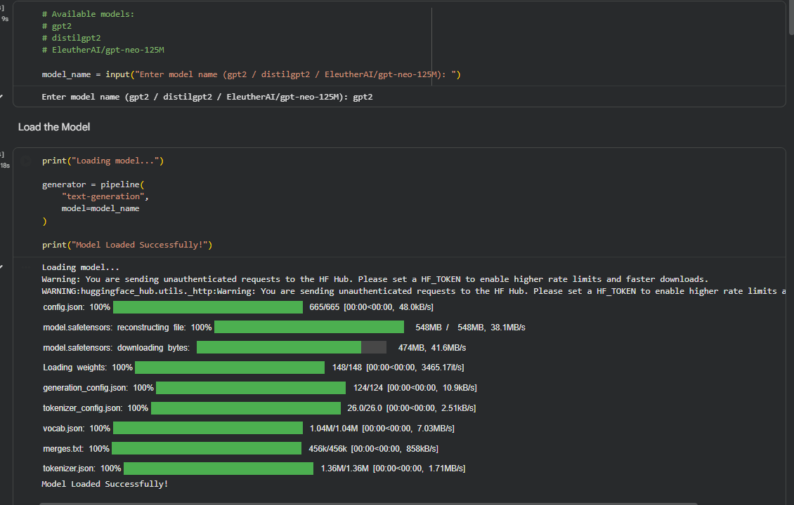
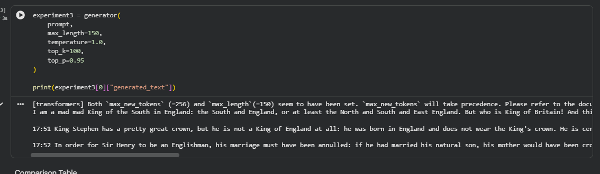
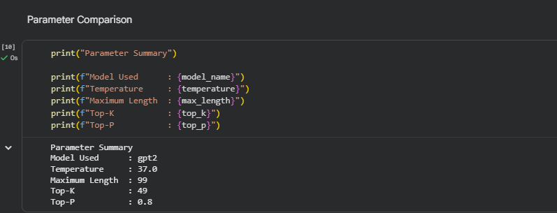
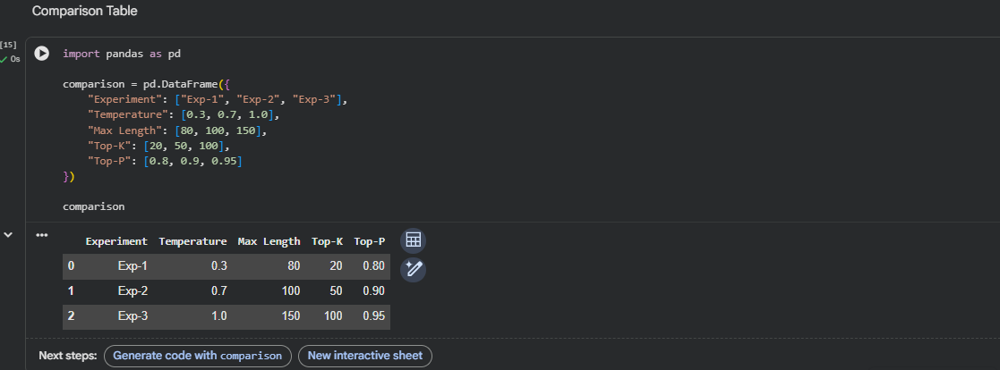

# LLM Text Generation with Hugging Face

A simple NLP project that demonstrates text generation using pre-trained Large Language Models (LLMs) with the Hugging Face Transformers library.

## Features

- Story Generation
- Technical Explanation Generation
- Question & Answer Generation
- Custom Prompt Input
- Adjustable Parameters:
  - Temperature
  - Max Length
  - Top-K
  - Top-P

## Technologies Used

- Python
- Hugging Face Transformers
- PyTorch
- Google Colab

## Supported Models

- GPT-2
- DistilGPT2
- EleutherAI/gpt-neo-125M

## Installation

Clone the repository:

```bash
git clone https://github.com/<your-github-username>/LLM-Text-Generation-with-HuggingFace.git
```

Install the required packages:

```bash
pip install -r requirements.txt
```

## How to Run

1. Open `Text_Generation_Using_HuggingFace.ipynb` in Google Colab or Jupyter Notebook.
2. Install the required libraries.
3. Select a pre-trained model.
4. Choose a task:
   - Story Generation
   - Technical Explanation
   - Question & Answer
5. Enter the generation parameters.
6. Run the notebook to generate text.

## Project Screenshots

### Model Loading



### Generated Output



### Parameter Comparison



### Experiment Comparison



## Learning Outcomes

- Understanding pre-trained LLMs
- Text generation using Hugging Face Transformers
- Prompt-based text generation
- Effect of Temperature, Top-K, Top-P, and Max Length

## Repository Structure

```
LLM-Text-Generation-with-HuggingFace/
│
├── LICENSE
├── README.md
├── requirements.txt
├── Text_Generation_Using_HuggingFace.ipynb
├── model_loading.png
├── output.png
├── parameter_comparison.png
└── comparison.png
```

## License

This project is licensed under the MIT License.

## Author

**Prince Tiwari**
Prince8879 https://github.com/Prince8879/LLM-Text-Generation-with-HuggingFace

